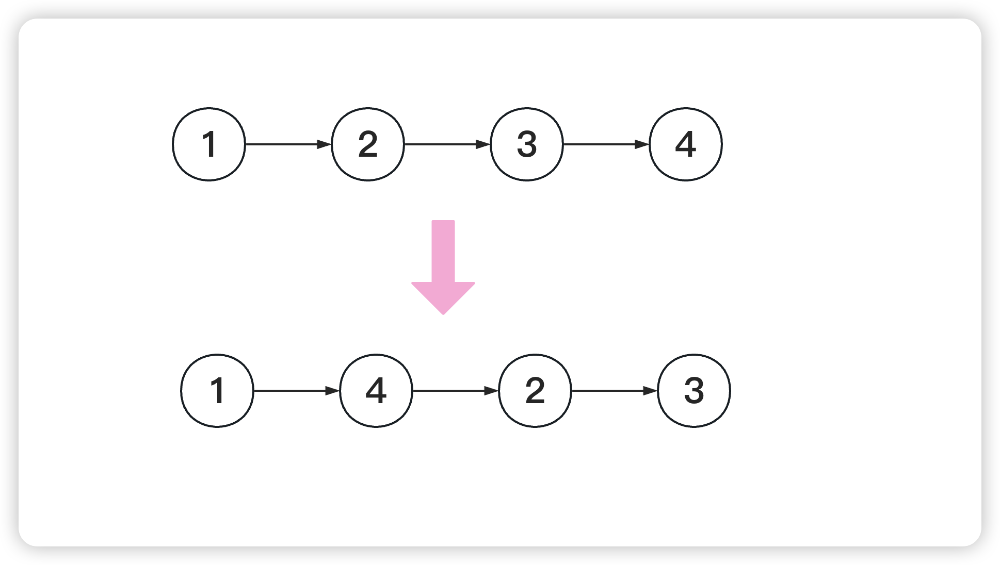

<!--
 * @Date: 2023-03-09 17:27:32
 * @Author: Bruce
 * @Description: 
-->
# 题目

```
给定一个单链表 L 的头节点 head ，单链表 L 表示为：
L0 → L1 → … → Ln - 1 → Ln
请将其重新排列后变为：
L0 → Ln → L1 → Ln - 1 → L2 → Ln - 2 → …
```



## 解题思路

```
1. 先找到中间的两个节点,使用快慢指针
2. 然后将右边的链表进行反转操作(206)
3. 依次进行排列
```

### **Python语言版本**

```
# Definition for singly-linked list.
# class ListNode:
#     def __init__(self, val=0, next=None):
#         self.val = val
#         self.next = next
class Solution:
    def reorderList(self, head: Optional[ListNode]) -> None:
        """
        Do not return anything, modify head in-place instead.
        """
        mid = self.getMid(head)
        leftHead = head
        rightHead = mid.next
        mid.next = None
        rightHead = self.reverse(rightHead)
        while leftHead and rightHead:
            leftHeadNext = leftHead.next
            rightHeadNext = rightHead.next
            
            leftHead.next = rightHead
            leftHead = leftHeadNext
            
            rightHead.next = leftHead
            rightHead = rightHeadNext

    def getMid(self, head: Optional[ListNode]) -> ListNode:
        slow = fast = head
        while fast is not None and fast.next is not None:
            slow = slow.next
            fast = fast.next.next
        return slow

    def reverse(self, head: Optional[ListNode]) -> ListNode:
        curr, prev = head, None
        while curr:
            prev, prev.next, curr = curr, prev, curr.next
        return prev
```

### **Go语言版本**

```
/**
 * Definition for singly-linked list.
 * type ListNode struct {
 *     Val int
 *     Next *ListNode
 * }
 */
func reorderList(head *ListNode)  {
    var leftHead = head
    var mid = getMid(head)
    var rightHead = reverse(mid.Next)
    mid.Next = nil
    for leftHead != nil && rightHead != nil {
        leftHead, leftHead.Next = leftHead.Next, rightHead
        rightHead, rightHead.Next = rightHead.Next, leftHead
    }
}

func getMid(head *ListNode) *ListNode{
    var slow, fast = head, head
    for fast != nil && fast.Next != nil {
        slow = slow.Next
        fast = fast.Next.Next
    }
    return slow
}

func reverse(head *ListNode) *ListNode{
    var curr, prev *ListNode = head, nil
    for curr != nil {
        curr.Next, prev = prev, curr.Next
        curr, prev = prev, curr
    }
    return prev
}
```

### **C语言版本**

```
struct ListNode* middleNode(struct ListNode* head) {
    struct ListNode* slow = head;
    struct ListNode* fast = head;
    while (fast->next != NULL && fast->next->next != NULL) {
        slow = slow->next;
        fast = fast->next->next;
    }
    return slow;
}

struct ListNode* reverseList(struct ListNode* head) {
    struct ListNode* prev = NULL;
    struct ListNode* curr = head;
    while (curr != NULL) {
        struct ListNode* nextTemp = curr->next;
        curr->next = prev;
        prev = curr;
        curr = nextTemp;
    }
    return prev;
}

void mergeList(struct ListNode* l1, struct ListNode* l2) {
    struct ListNode* l1_tmp;
    struct ListNode* l2_tmp;
    while (l1 != NULL && l2 != NULL) {
        l1_tmp = l1->next;
        l2_tmp = l2->next;

        l1->next = l2;
        l1 = l1_tmp;

        l2->next = l1;
        l2 = l2_tmp;
    }
}

void reorderList(struct ListNode* head) {
    if (head == NULL) {
        return;
    }
    struct ListNode* mid = middleNode(head);
    struct ListNode* l1 = head;
    struct ListNode* l2 = mid->next;
    mid->next = NULL;
    l2 = reverseList(l2);
    mergeList(l1, l2);
}
```