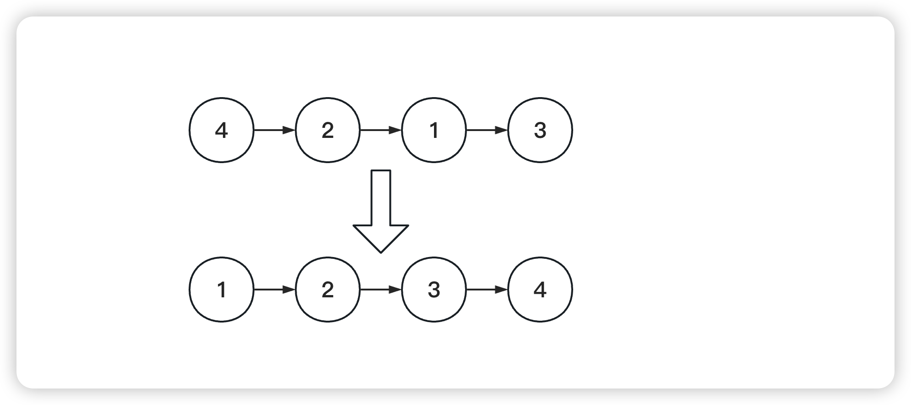

<!--
 * @Date: 2023-03-07 15:02:40
 * @Author: Bruce
 * @Description: 
-->
# 题目

```
给你链表的头节点head, 请将其按升序排列并返回排序后的链表
```



## 解题思路

```
1. 通过快慢指针,找到链表中点
2. 断链操作,切掉链表的前n个节点,并返回后半部分的链表头
3. 合并两个有序链表
```

### **Python语言版本**

```
# Definition for singly-linked list.
# class ListNode:
#     def __init__(self, val=0, next=None):
#         self.val = val
#         self.next = next
class Solution:
    def sortList(self, head: Optional[ListNode]) -> Optional[ListNode]:
        
        def getLength(head):
            res = 0
            while head:
                head = head.next
                res += 1
            return res
        
        def split(head, step):
            # 断链操作,返回第二部分的链表头
            if not head:
                return None
            curr = head
            for _ in range(1, step):
                if not curr.next:
                    break
                curr = curr.next
            res, curr.next = curr.next, None
            return res
        
        def merge(h1, h2):
            res = h = ListNode()
            while h1 and h2:
                if h1.val < h2.val:
                    h.next, h1 = h1, h1.next
                else:
                    h.next, h2 = h2, h2.next
                h = h.next
            h.next = h1 if h1 else h2
            return res.next
        
        length = getLength(head)
        dummy = ListNode()
        dummy.next = head
        step = 1

        while step < length:
            prev, curr = dummy, dummy.next
            while curr:
                h1 = curr
                h2 = split(h1, step)
                curr = split(h2, step)
                temp = merge(h1, h2)
                prev.next = temp
                while prev.next:
                    prev = prev.next
            step *= 2
        return dummy.next
        

```