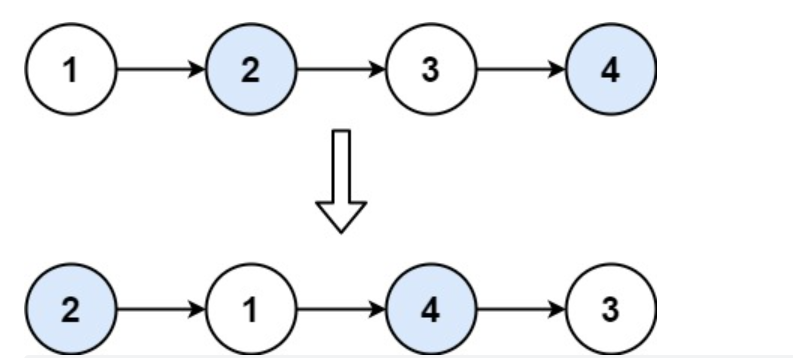

# 题目

```
给你一个链表，两两交换其中相邻的节点，并返回交换后链表的头节点。
你必须在不修改节点内部的值的情况下完成本题（即，只能进行节点交换）
```



## 解题思路

```
1. 使用递归的方法去解决这个问题
2. 首先判断链表和链表的下一个节点是否为空，如果为空，直接返回
3. 不断地递归，递归的最小微粒在最后一个或者最后两个节点
4. 然后head.next指向head,head指向最小微粒
```

### **Python语言版本**

```
# Definition for singly-linked list.
# class ListNode:
#     def __init__(self, val=0, next=None):
#         self.val = val
#         self.next = next
class Solution:
    def swapPairs(self, head: Optional[ListNode]) -> Optional[ListNode]:
        if not head or not head.next:
            return head
        subHead = self.swapPairs(head.next.next)
        headNext = head.next
        headNext.next = head
        head.next = subHead
        return headNext
```