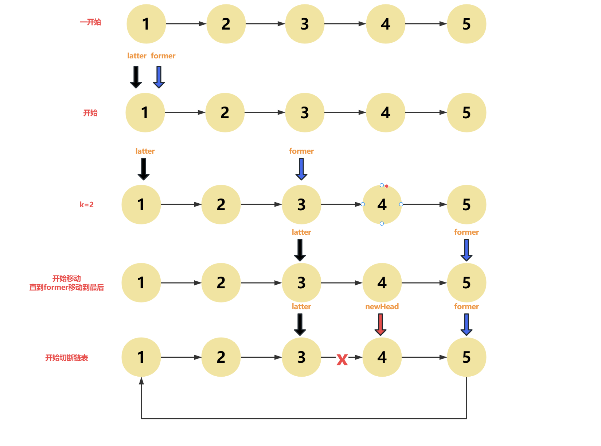

# 题目

```
给你一个链表的头节点 head ，旋转链表，将链表每个节点向右移动 k 个位置
```

## 解题思路



```
1. 首先求出链表的长度
2. 设置former和latter指针，并指向head位置
3. 根据参数k让former移动k个节点
4. 同时移动former和latter指针,当former遍历到最后一个节点时，遍历结束
5. 让latter节点指向NULL,former指向head节点
```

### **Python语言版本**

```
# Definition for singly-linked list.
# class ListNode:
#     def __init__(self, val=0, next=None):
#         self.val = val
#         self.next = next
class Solution:
    def rotateRight(self, head: Optional[ListNode], k: int) -> Optional[ListNode]:
        if not head or k == 0:
            return head
        len = 0
        tempHead = head
        while tempHead:
            tempHead = tempHead.next
            len += 1
        k = k % len

        former = latter = head
        for _ in range(k):
            former = former.next
        
        while former.next:
            former = former.next
            latter = latter.next
        former.next = head
        newHead = latter.next
        latter.next = None
        return newHead
```

### **Go语言版本**

```
/**
 * Definition for singly-linked list.
 * type ListNode struct {
 *     Val int
 *     Next *ListNode
 * }
 */
func rotateRight(head *ListNode, k int) *ListNode {
    if head == nil || k == 0 {
        return head
    }
    len := 0
    var tempHead *ListNode = head
    for tempHead != nil {
        tempHead = tempHead.Next
        len++
    }

    k = k % len
    var former *ListNode = head
    var latter *ListNode = head
    for i := 0; i < k; i++{
        former = former.Next
    }

    for former.Next != nil {
        latter = latter.Next
        former = former.Next
    }
    former.Next = head
    var newHead *ListNode = latter.Next
    latter.Next = nil
    return newHead

}
```

### **C语言版本**

```
/**
 * Definition for singly-linked list.
 * struct ListNode {
 *     int val;
 *     struct ListNode *next;
 * };
 */


struct ListNode* rotateRight(struct ListNode* head, int k){
    if(head == NULL || k == 0 || head->next == NULL) {
        return head;
    }
    int len = 0;
    struct ListNode* tempHead = head;
    while(tempHead != NULL){
        tempHead = tempHead->next;
        len++;
    }
    struct ListNode* latter = head;
    struct ListNode* former = head;
    k = k % len;
    for (int i = 0; i < k; i++){
        former = former->next;
    }
    while(former->next != NULL){
        latter = latter->next;
        former = former->next;
    }
    former->next = head;
    struct ListNode* newHead = latter->next;
    latter->next = NULL;
    return newHead;
}
```