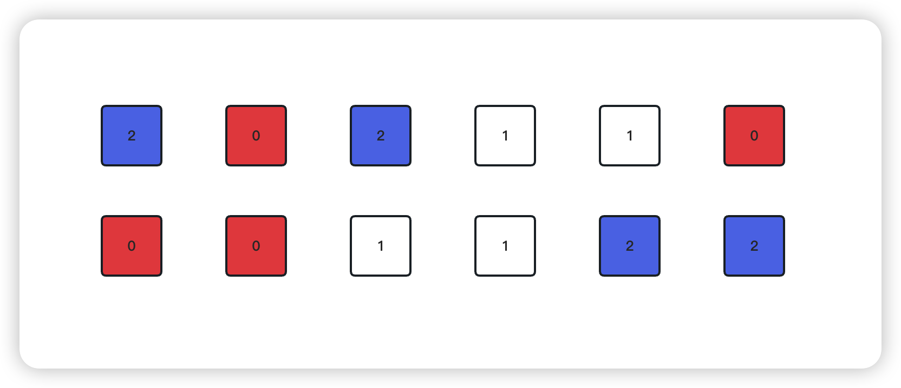

<!--
 * @Date: 2023-03-02 14:56:40
 * @Author: Bruce
 * @Description: Solve the problem of leetcode 75
-->
# 题目

```
给定一个包含红色、白色和蓝色、共 n 个元素的数组 nums ，原地对它们进行排序，使得相同颜色的元素相邻，并按照红色、白色、蓝色顺序排列。

我们使用整数 0、 1 和 2 分别表示红色、白色和蓝色。

必须在不使用库内置的 sort 函数的情况下解决这个问题。
```



## 解题思路

```
使用两个指针, left 和 right 指针, left指针指向数组最左边的元素,right指针指向数组最右边的元素
开始遍历数组,index为遍历索引
1.index指向的值与left指针指向的元素进行判断,如果为0,那么left和index指向的元素互换位置,left 和 index的索引值都加1
2.index向右继续遍历,如果为1,那么index的索引值加1
3.index向右继续遍历,如果为2,那么index和right指向的元素互换位置,right索引减1
跳出循环的条件为: while index <= right
```

### **Python语言版本**

```
class Solution:
    def sortColors(self, nums: List[int]) -> None:
        """
        Do not return anything, modify nums in-place instead.
        """
        left = index = 0
        right = len(nums) - 1
        while index <= right:
            cur = nums[index]
            if cur == 0:
                nums[index], nums[left] = nums[left], nums[index]
                left += 1
                index += 1
            elif cur == 1:
                index += 1
            elif cur == 2:
                nums[right], nums[index] = nums[index], nums[right]
                right -= 1

```

### **C语言版本**

```
void sortColors(int* nums, int numsSize){
    int left = 0, index = 0;
    int right = numsSize - 1;
    while (index <= right) {
        int curValue = nums[index];
        int temp;
        if (curValue == 0){
            temp = nums[left];
            nums[left] = nums[index];
            nums[index] = temp;
            left++;
            index++;          
        }else if(curValue == 1){
            index++;
        }else{
            temp = nums[right];
            nums[right] = nums[index];
            nums[index] = temp;
            right--;
        }
    }
}

```

### **Go语言版本**

```
func sortColors(nums []int)  {
    var (
        left int
        index int
        right = len(nums) - 1
    )
    for index <= right {
        curValue := nums[index]
        if curValue == 0 {
            nums[left], nums[index] = nums[index], nums[left]
            left++
            index++
        }else if curValue == 1 {
            index++
        }else{
            nums[right], nums[index] = nums[index], nums[right]
            right--
        }
    }
}
```

### **复杂度分析**
- 时间复杂度: O(N),其中N是给定数组的长度
- 空间复杂度: O(1),只需要常量空间left, right指针