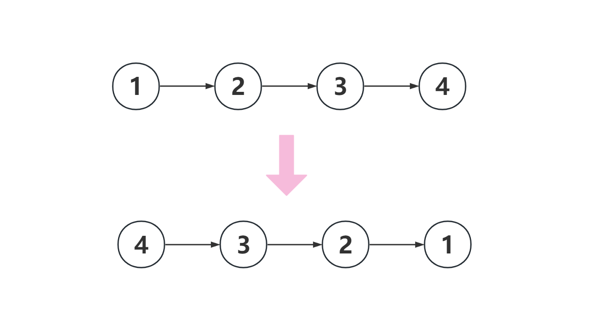

<!--
 * @Date: 2023-03-09 15:32:39
 * @Author: Bruce
 * @Description: 
-->
# 题目

```
给你单链表的头节点 head ，请你反转链表，并返回反转后的链表
```



## 解题思路

```
1. 创建节点
2. 遍历整个链表,首先保存第一个节点
3. 让接下来的节点引用前一个节点
```

### **Go语言版本**

```
/**
 * Definition for singly-linked list.
 * type ListNode struct {
 *     Val int
 *     Next *ListNode
 * }
 */
func reverseList(head *ListNode) *ListNode {
    var prev *ListNode
    curr := head
    for curr!= nil {
        prev, curr.Next = curr.Next, prev
        prev, curr = curr, prev
    }
    return prev
}
```

### **Python语言版本**

```
# Definition for singly-linked list.
# class ListNode:
#     def __init__(self, val=0, next=None):
#         self.val = val
#         self.next = next
class Solution:
    def reverseList(self, head: Optional[ListNode]) -> Optional[ListNode]:
        curr, prev = head, None
        while curr:
            prev, prev.next, curr = curr, prev, curr.next
        return prev
```