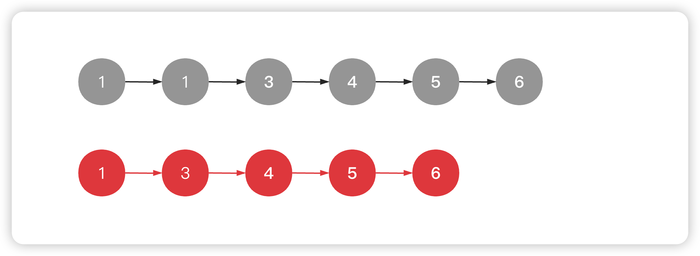

<!--
 * @Date: 2023-02-28 13:56:28
 * @Author: Bruce
 * @Description: Solve the problem of leetcode 26
-->
# 题目

```
给一个升序排列的数组nums,原地删除重复出现的元素,使得每个元素只出现一次,返回删除后数组的新长度
元素的相对顺序应保持一致
```



```Python
class Solution:
    def removeDuplicates(self, nums: List[int]) -> int:
        j = 0
        for i in range(len(nums)):
            if i == 0 or nums[i] != nums[i-1]:
                nums[j] = nums[i]
                j += 1
        return j
```

```Go
func removeDuplicates(nums []int) int {
    j := 0
    for i := range nums{
        if i == 0 || nums[i] != nums[i-1]{
            nums[j] = nums[i]
            j += 1
        }
    }
    return j
}
```

```C
int removeDuplicates(int* nums, int numsSize){
    int j = 0;
    for (int i = 0; i < numsSize; i++){
        if(i==0 || nums[i] != nums[i-1]){
            nums[j] = nums[i];
            j++;
        }
    }
    return j;
}
```

### **复杂度分析**
- 时间复杂度: O(N),其中N是给定链表的节点数目
- 空间复杂度: O(1),只需要常量空间放j就可以