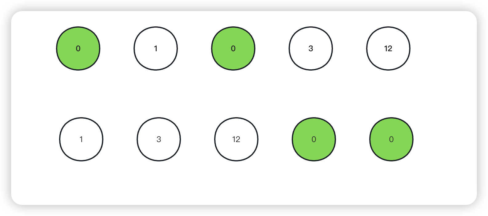

<!--
 * @Date: 2023-03-01 14:51:09
 * @Author: Bruce
 * @Description: 
-->
# 题目

```
给定一个数组 nums，编写一个函数将所有 0 移动到数组的末尾，同时保持非零元素的相对顺序。

请注意 ，必须在不复制数组的情况下原地对数组进行操作
```



## 解题思路

```
使用两个指针去进行判断, slow和fast指针
当fast指针去遍历整个数组,如果nums[fast]不等于0,那么slow指针位置向右移动,然后进行数据交换
```

### **Go语言版本**

```
func moveZeroes(nums []int)  {
    var slow, fast int
    for fast < len(nums) {
        if nums[fast] != 0 {
            nums[slow], nums[fast] = nums[fast], nums[slow]
            slow++
        }
        fast++
    }
}
```

### **C语言版本**

```
void moveZeroes(int* nums, int numsSize){
    int slow = 0; 
    int fast = 0;
    while(fast<numsSize){
        if(nums[fast]!=0){
            int temp = nums[slow];
            nums[slow] = nums[fast];
            nums[fast] = temp;
            slow++;
        }
        fast++;
    }
}
```

### **Python语言版本**

```
class Solution:
    def moveZeroes(self, nums: List[int]) -> None:
        """
        Do not return anything, modify nums in-place instead.
        """
        slow = fast = 0
        while fast < len(nums):
            if nums[fast] != 0:
                nums[slow], nums[fast] = nums[fast], nums[slow]
                slow += 1
            fast += 1
```

### **复杂度分析**
- 时间复杂度: O(N),其中n为序列长度,每个位置至多被遍历两次
- 空间复杂度: O(1),只需要常数的空间存放若干变量
