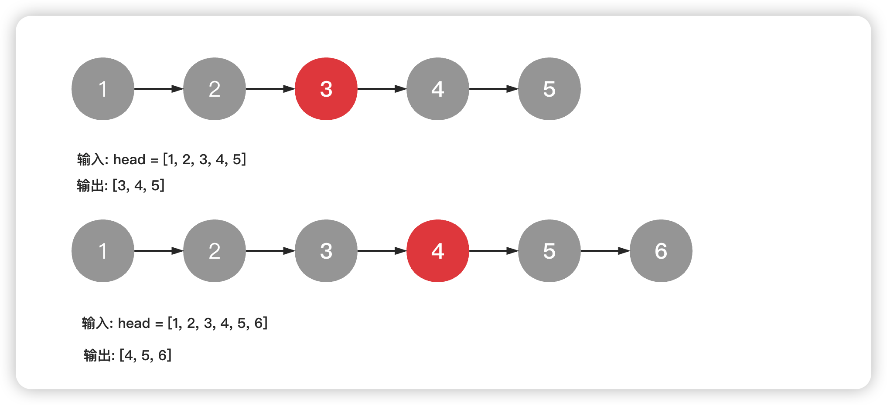
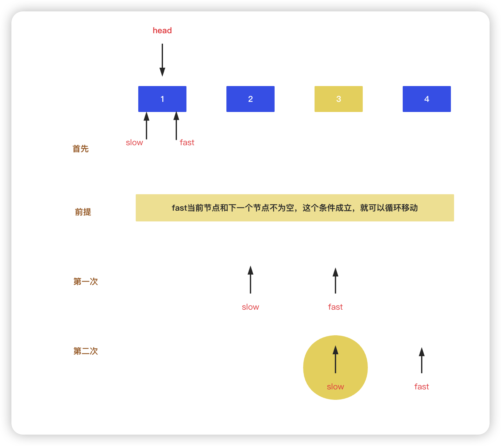

<!--
 * @Date: 2023-02-28 13:51:28
 * @Author: Bruce
 * @Description: 
-->
## 题目

```
给你单链表的头结点 head ，请你找出并返回链表的中间结点。

如果有两个中间结点，则返回第二个中间结点
```



## 解题思路图



### **Go语言版本**

```Go
/**
 * Definition for singly-linked list.
 * type ListNode struct {
 *     Val int
 *     Next *ListNode
 * }
 */

func middleNode(head *ListNode) *ListNode {
    slow, fast = head, head
    for fast != nil && fast.Next != nil {
        slow = slow.Next
        fast = fast.Next.Next
    }
    return slow
}
```

### **Python语言版本**

```Python
# Definition for singly-linked list.
# class ListNode:
#     def __init__(self, val=0, next=None):
#         self.val = val
#         self.next = next
class Solution:
    def middleNode(self, head: Optional[ListNode]) -> Optional[ListNode]:
        slow, fast = head, head
        while fast is not None and fast.next is not None:
            slow = slow.next
            fast = fast.next.next
        return slow
```

### **C语言版本**

```C
/**
 * Definition for singly-linked list.
 * struct ListNode {
 *     int val;
 *     struct ListNode *next;
 * };
 */


struct ListNode* middleNode(struct ListNode* head){
    struct ListNode* slow = head;
    struct ListNode* fast = head;
    while (fast && fast->next){
        slow = slow->next;
        fast = fast->next->next;
    }
    return slow;
}
```