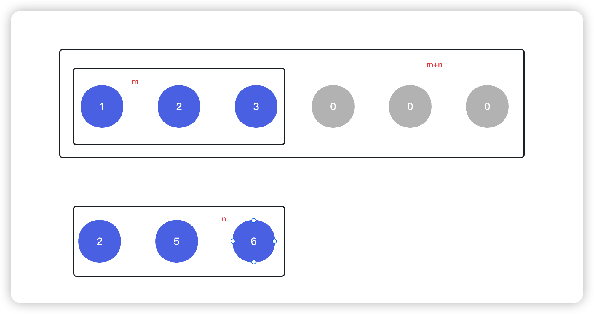

<!--
 * @Date: 2023-03-03 13:39:21
 * @Author: Bruce
 * @Description: Solve the problem of leetcode 75
-->
# 题目

```
给你两个按 非递减顺序 排列的整数数组 nums1 和 nums2，另有两个整数 m 和 n ，分别表示 nums1 和 nums2 中的元素数目。
请你 合并 nums2 到 nums1 中，使合并后的数组同样按 非递减顺序 排列。

注意：最终，合并后数组不应由函数返回，而是存储在数组 nums1 中。为了应对这种情况，nums1 的初始长度为 m + n，其中前 m 个元素表示应合并的元素，后 n 个元素为 0 ，应忽略。nums2 的长度为 n 。
```



## 解题思路

```
使用三个指针分别 i, j, cur
i: 指向m元素数组的最后一个位置
j: 指向n元素数组的最后一个位置
cur: 指向m+n元素数组的最后一个位置
依次开始遍历遍历m+n元素数组,cur从后向前遍历,比较i和j指向的数值大小,然后将较大的数值赋值给cur指向的元素
然后cur前移,数值大的索引前移
```

### **Python语言版本**

```
class Solution:
    def merge(self, nums1: List[int], m: int, nums2: List[int], n: int) -> None:
        """
        Do not return anything, modify nums1 in-place instead.
        """
        i = m - 1
        j = n - 1
        cur = len(nums1) - 1
        while j >= 0:
            if i >=0 and nums1[i] > nums2[j]:
                nums1[cur] = nums1[i]
                cur -= 1
                i -= 1
            else:
                nums1[cur] = nums2[j]
                cur -= 1
                j -= 1
```